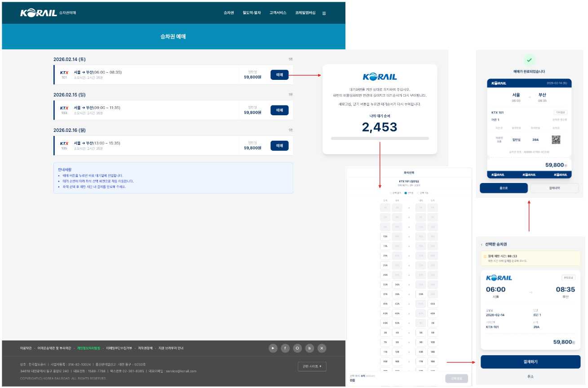
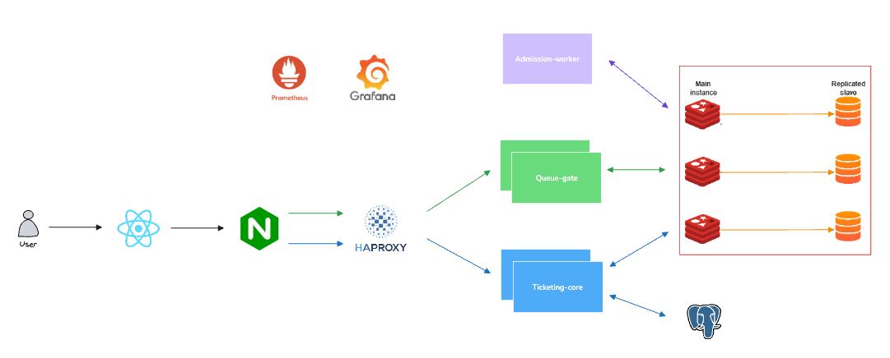
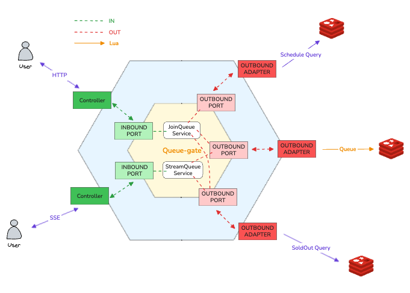
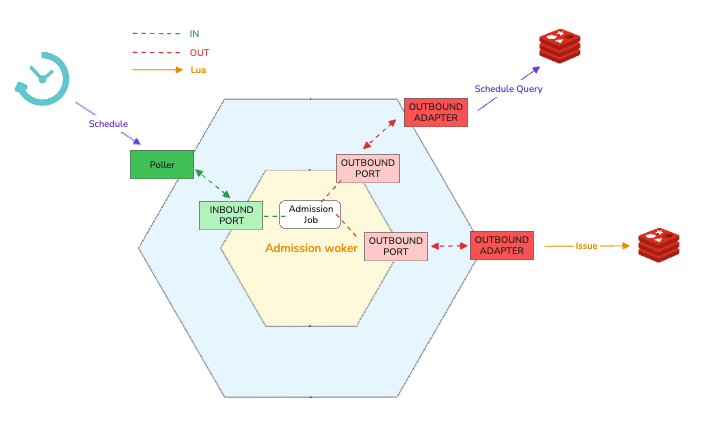
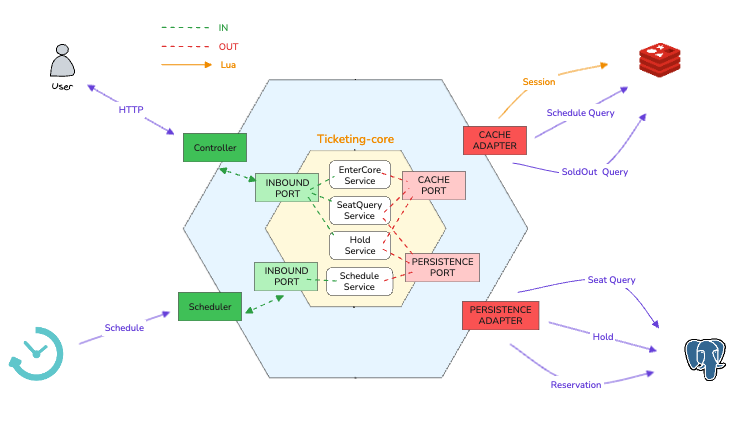
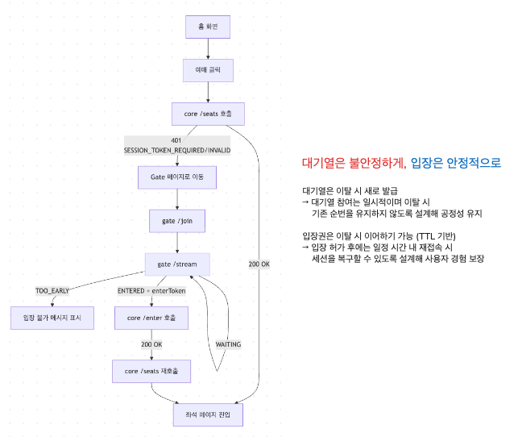
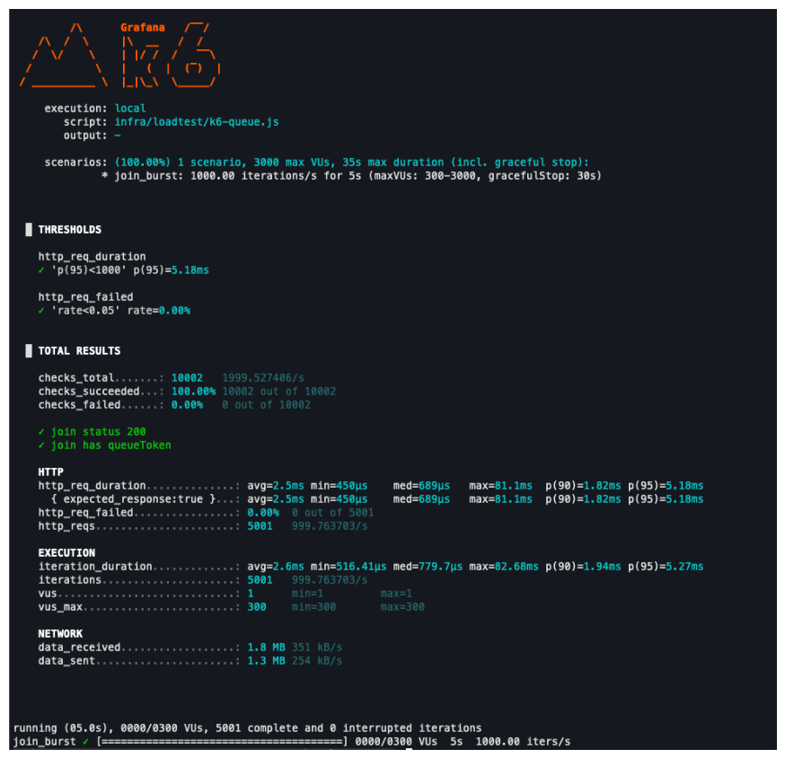
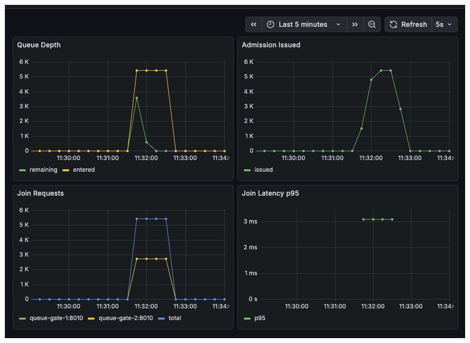
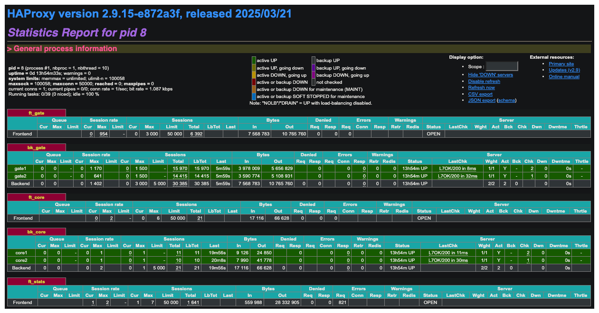

# Admission System

**동시 접속 100만을 가정한 티켓팅 대기열 시스템**

단순히 요청을 쌓아두는 큐를 넘어, 폭발적인 트래픽 스파이크로부터 코어 시스템을 보호하고 사용자에게는 정교하게 계산된 순번을 제공하기 위해 설계된 시스템입니다. 대규모 예매나 이벤트 환경에서 발생할 수 있는 동시성 이슈와 병목 현상을 구조적으로 해결하는 데 집중했습니다.

대기열(Queue) → 입장권(Admission) → 좌석 선점(Hold) → 확정(Confirm) 흐름을 구현하며, Redis Cluster + Lua 원자 처리로 **순서 공정성**, **좌석 중복 구매 방지**, **실시간 UX**를 보장합니다.



---

## 시스템 아키텍처



| 컴포넌트 | 역할 |
|----------|------|
| **Queue Gate** | 대기열 등록, SSE 실시간 스트리밍 |
| **Admission Worker** | 폴링 기반 입장권 배치 발급 (rate/concurrency cap) |
| **Ticketing Core** | 입장 핸드셰이크, 좌석 조회·홀드·확정, 세션 관리 |
| **HAProxy** | Gate/Core 로드밸런싱 (leastconn, SSE 장기 연결 지원) |
| **Redis Cluster** | 대기열 ZSET, 토큰 저장, 세션 관리 (3 Master + 3 Replica) |
| **PostgreSQL** | 좌석·홀드·예약 영구 저장 |
| **React SPA** | SSE 대기열, 좌석 선택 UI, 결제 타이머 |

---

## 기술 스택

**Backend** </br>


**Database** </br>


**Infra** </br>


**Frontend** </br>


**Monitoring** </br>


---

## 모듈 구조

```
admission-system/
├── common/               # 공유 코드 (Redis 키, HMAC 토큰, 에러 코드)
├── queue-gate/            # 대기열 게이트 (WebFlux, SSE)
├── admission-worker/      # 입장권 발급 워커 (Polling + Lua 배치)
├── ticketing-core/        # 좌석 코어 (WebFlux + R2DBC + DDD)
├── frontend/              # React SPA
├── infra/                 # Docker Compose, HAProxy, Nginx, Prometheus, Grafana
└── docs/                  # 설계 문서
```

모듈 간 직접 의존 없이, `common`만 공유하고 런타임 연결은 **Redis 토큰**으로 수행합니다.

---

## 모듈 아키텍처

모든 모듈은 **Hexagonal Architecture (Ports & Adapters)** 를 적용합니다.

- `domain/`, `application/` — 프레임워크 의존 X (순수 Java)
- `adapter/` — Spring WebFlux, Lettuce, R2DBC 등 프레임워크 구현체

### Queue Gate



- **Lua 원자 처리**: 중복 등록 방지 + 상태 저장 + ZADD를 단일 Lua 스크립트로 실행
- **ZSET 순서 보장**: 스코어 기반 공정한 순서 결정
- **SSE 스트리밍**: 1초 주기로 대기 상태를 실시간 푸시 (WAITING → ADMISSION_GRANTED / SOLD_OUT)
- **멱등 Join**: 동일 clientId의 중복 요청 시 기존 queueToken 반환

### Admission Worker



- **이중 제한 정책**: `min(rateCap, concurrencyCap - currentActive, maxBatch)` 로 발급량 산출
- **ZPOPMIN 소비**: 대기열 ZSET에서 상위 N명을 원자적으로 꺼내어 입장권 발급
- **토큰 사전 생성**: Lua 내 UUID 생성 불가 → Java에서 jti+token을 미리 생성하여 ARGV로 전달
- **200ms 폴링**: `@Scheduled` 주기적 실행, 멀티 워커 환경에서도 Lua 원자성으로 중복/초과 발급 방지

### Ticketing Core



- **Lua 핸드셰이크**: enterToken DEL + coreSession SET + active SADD를 원자적으로 처리
- **Hold 도메인**: Aggregate Root로 만료 검증(`isExpired`), 소유자 검증(`belongsTo`) 불변식 보장
- **DB 유니크 제약**: `UNIQUE(schedule_id, seat_id)` + `UNIQUE(schedule_id, client_id)` 로 이중 판매 원천 차단
- **슬라이딩 세션**: 매 API 호출 시 coreSession TTL 갱신 (5분), 무활동 시 자동 만료

---

## 사용자 흐름



1. **예매 시도** — `GET /core/seats` 호출로 기존 세션 확인. 유효한 세션이 있으면 바로 좌석 페이지 진입
2. **대기열 진입** — 세션이 없으면(401) Gate 페이지로 이동, `POST /gate/join`으로 대기열 등록
3. **실시간 대기** — `GET /gate/stream` SSE로 순위 변동 실시간 확인
4. **입장** — ADMISSION_GRANTED + enterToken 수신 → `POST /core/enter` → 쿠키 기반 세션 발급
5. **좌석 선택** — `GET /core/seats`로 좌석 맵 조회, `POST /core/holds`로 복수 좌석 선점 (60초 TTL)
6. **확정** — `POST /core/holds/{holdGroupId}/confirm`으로 예약 확정, 세션 종료

---

## API 요약

### Queue Gate

| Method | Endpoint | 설명 |
|--------|----------|------|
| POST | `/gate/join` | 대기열 등록 (Lua 원자 처리) |
| GET | `/gate/stream` | SSE 대기열 상태 스트리밍 |
| GET | `/gate/status` | 대기열 상태 조회 (polling fallback) |

### Ticketing Core

| Method | Endpoint | 설명 |
|--------|----------|------|
| POST | `/core/enter` | enterToken → coreSession 핸드셰이크 (쿠키 세션 발급) |
| GET | `/core/seats` | 좌석 목록 조회 (zone별 그룹핑) |
| POST | `/core/holds` | 복수 좌석 선점 (holdGroup 생성) |
| POST | `/core/holds/{holdGroupId}/confirm` | holdGroup 확정 → 예약 생성 |

### Admin

| Method | Endpoint | 설명 |
|--------|----------|------|
| GET | `/core/schedules/active` | 활성 스케줄 목록 조회 |
| GET | `/core/admin/schedules/activate` | 전체 스케줄 활성화 |
| DELETE | `/core/admin/schedules` | 활성 스케줄 초기화 |

---

## 실행 방법

### Prerequisites

- Docker & Docker Compose
- Java 21 (로컬 빌드 시)
- Node.js 22 (프론트엔드 로컬 개발 시)

### 실행

```bash
# 1. 인프라 (PostgreSQL, Redis Cluster)
docker compose -f infra/docker-compose.infra.yml up -d

# 2. 앱 (Queue Gate x2, Admission Worker, Ticketing Core x2, HAProxy, Prometheus, Grafana)
docker compose -f infra/docker-compose.app.yml up -d --build

# 3. 프론트엔드 (개발 모드)
cd frontend && npm install && npm run dev
```

### 접속

| 서비스 | URL |
|--------|-----|
| Frontend (dev) | http://localhost:3000 |
| Queue Gate (HAProxy) | http://localhost:8010 |
| Ticketing Core (HAProxy) | http://localhost:8030 |
| HAProxy Stats | http://localhost:9000 |
| Grafana Dashboard | http://localhost:4000 |
| Prometheus | http://localhost:9091 |
| Redis Insight | http://localhost:5540 |

---

## 부하 테스트 & 모니터링

### k6 부하 테스트



```bash
k6 run infra/loadtest/k6-queue.js
```

- 1,000 req/s 버스트 시나리오 (constant-arrival-rate)
- 임계값: 에러율 < 5%, p95 응답 시간 < 1,000ms

### Grafana Dashboard



- Queue Depth, Admission Issued, Join Rate, Latency p95 등 핵심 메트릭 시각화

### HAProxy Stats



- Gate/Core 백엔드별 연결 수, 응답 시간, 헬스 체크 현황

---

## 문서

| 문서 | 설명 |
|------|------|
| [Architecture](docs/architecture.md) | 시스템 아키텍처, 모듈 구조, 헥사고날 패턴 상세 |
| [Data Design](docs/data-design.md) | Redis 키 설계, Lua 스크립트, DB 스키마, 상태 머신 |
| [API Specification](docs/api-specification.md) | API 명세, 요청/응답 포맷, 에러 코드 |
| [Flow](docs/flow.md) | End-to-End 요청 흐름, 모듈별 호출 체인 |
| [Edge Cases](docs/edge-cases.md) | 엣지 케이스 및 장애 시나리오 |
